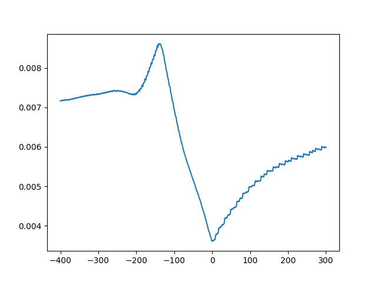
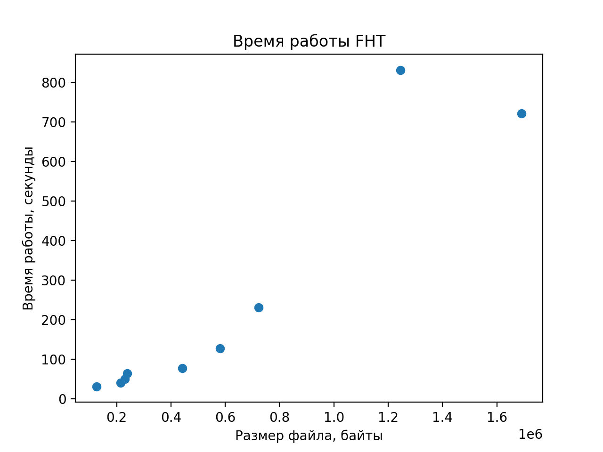

### Локальный запуск
```shell
echo '{номер примера}' | python3 ./run.py
```
Во время запуска в файле out/variances.png будет рисоваться график дисперсии в зависимости от shift'а. Для шестой картинки он вышел такой: 



В консоль пишется оптимальный shift и соответствующий ему угол.

Все исходные изображения лежат в папке img, результаты работы моей реализации лежат в папке out.

### Асимптотика
Количество операций при поиске направления с максимальной дисперсией можно оценить через $O(N^2 \log N)$. А памяти нужно O(1), потому что у меня LRU-Кеш на $10^8$ состояний.
График времени работы:



### Оптимизации
Почти на всех фотографиях достаточно перебирать маленький по модулю shift. Кроме того, достаточно рассмотреть рандомный достаточно большой прямоугольный кусок фотографии и попробовать найти на нем направление наибольшей дисперии. Последнее еще и защищает от бликов и теней, которые, как видно по результатам работы моей реализации, сильно влияют на дисперсию